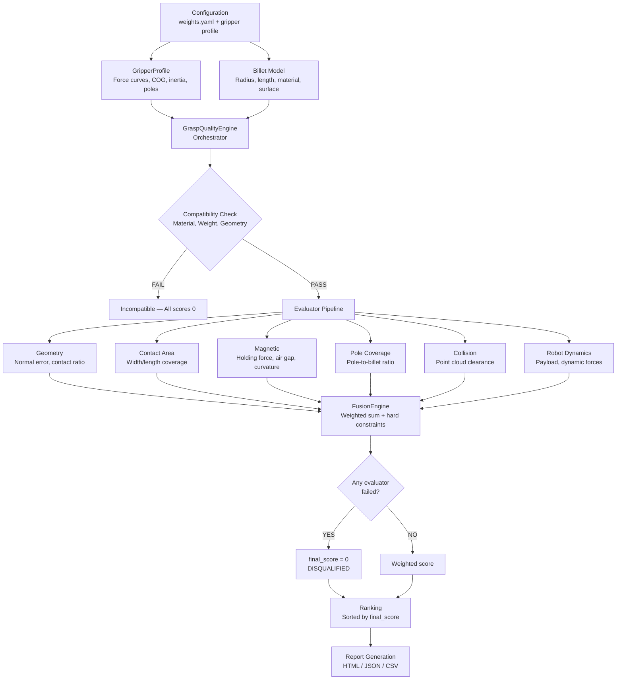

# MagPick-GQE

### Industrial Grasp Quality Evaluation for Magnetic Grippers

[](https://python.org)
[](https://open3d.io)
[]()
[]()

> A production-grade robotic grasp quality evaluation framework for **magnetic grippers** in industrial manufacturing environments. Evaluates grasp candidates across 6 physics-based criteria with hard-constraint safety policy, generates multi-view 3D snapshots, and produces engineering-ready HTML/JSON/CSV reports.

---

## Key Features

- **6 Physics-Based Evaluators** — Geometry, Contact Area, Magnetic Force, Pole Coverage, Collision Avoidance, Robot Dynamics
- **Hard-Constraint Safety Policy** — Any single evaluator failure immediately disqualifies the candidate (score = 0). Safety-critical for physical manipulation.
- **Interactive Dash UI** — Full web-based HMI with 3D viewport, candidate selection, radar charts, force analysis, and real-time evaluation
- **Multi-View 3D Snapshots** — Open3D renders isometric, top, front, and side views of each grasp candidate with gripper + billet + pole visualization
- **Production HTML Report** — Executive dashboard, Chart.js radar charts, force vector SVG diagrams, progress bars, engineering recommendations
- **Report Download** — Export evaluation results as self-contained HTML or structured JSON from the dashboard
- **Config-Driven Architecture** — Single `weights.yaml` source of truth for all evaluator weights, thresholds, material factors, and surface factors
- **Gripper Profile System** — YAML-based profiles with force curves, center of gravity, inertia tensors, and pole layouts
- **Pre-Flight Compatibility Checks** — Validates material ferromagnetism, weight limits, and geometry before running full evaluation
- **Billet Type Library** — SKU-based object recognition for automatic gripper-billet matching

---

## Architecture



---

## Quick Start

```bash
# Clone the repository
git clone https://github.com/sumitpandit-robotics/MagPick-GQE.git
cd MagPick-GQE

# Create virtual environment and install
python3 -m venv .venv
source .venv/bin/activate
pip install -e .

# Run the full test suite (82 pytest tests)
PYTHONPATH="" pytest tests/ -v \
  -p no:launch_testing -p no:launch_testing_ros2 \
  -p no:ament_copyright -p no:ament_flake8 \
  -p no:ament_lint -p no:ament_xmllint -p no:ament_pep257

# Run end-to-end verification (47 checks + report generation)
PYTHONPATH="" python run_test.py

# Open the HTML report
xdg-open output/evaluation_report.html

# Launch the interactive Dash UI
python run_ui.py
# → http://localhost:8050
```

---

## Configuration

### Single Source of Truth: `config/weights.yaml`

All evaluator weights, thresholds, material factors, and surface factors are defined in one file:

```yaml
geometry:
  weight: 0.25
  max_normal_error_deg: 15.0
  minimum_contact_ratio: 0.80

magnetic:
  weight: 0.30
  minimum_safety_factor: 2.0
  material_factor:
    steel: 1.0
    aluminium: 0.0      # Fails safe — non-ferromagnetic
    cast_iron: 0.85
    titanium: 0.0       # Non-ferromagnetic
    unknown: 0.0        # Fails safe — worst case
  surface_factor:
    dry: 1.0
    oily: 0.85
    painted: 0.70
    rusty: 0.50
    unknown: 0.0        # Fails safe

collision:
  weight: 0.15
  min_clearance_m: 0.005

contact_area:
  weight: 0.15
  min_area_ratio: 0.85

pole_coverage:
  weight: 0.05
  min_coverage_ratio: 0.60

robot_dynamics:
  weight: 0.10
  min_payload_margin: 1.2
  min_dynamic_sf: 1.5
  emergency_stop_factor: 2.0
```

### Gripper Profiles

YAML-based gripper definitions with full physical parameters:

```yaml
# config/grippers/schmalz_sgm_hp_40x121.yaml
name: "Schmalz SGM-HP 40x121"
type: "magnetic"

footprint:
  shape: "rectangle"
  width_m: 0.040
  length_m: 0.121

force:
  rated_force_n: 1070.0
  force_curve:
    0.0: 1070.0
    0.5: 850.0
    1.0: 620.0
    2.0: 340.0
    3.0: 180.0
    5.0: 60.0

cog_m: [0.0, 0.0, -0.045]

pole_layout:
  num_poles: 8
  pole_positions_m:
    - [-0.045, -0.025]
    - [-0.015, -0.025]
    # ... 8 poles total
  pole_diameter_m: 0.018
```

---

## Evaluators

| Evaluator | Weight | What It Checks | Pass Criteria |
|-----------|--------|----------------|---------------|
| **Geometry** | 0.25 | Approach angle vs surface normal, contact quality | Normal error < 15, contact ratio > 0.80 |
| **Magnetic** | 0.30 | Holding force vs required force, air gap, curvature | Safety factor > 2.0, material recognized |
| **Contact Area** | 0.15 | Gripper pad coverage on billet surface | Coverage ratio > 85% |
| **Collision** | 0.15 | Clearance from nearby obstacles in point cloud | Clearance score > 0.50, min gap > 5mm |
| **Pole Coverage** | 0.05 | Magnetic poles aligned with billet contact zone | Coverage ratio > 60% |
| **Robot Dynamics** | 0.10 | Payload margin, dynamic forces during motion | Payload margin > 1.2x, dynamic SF > 1.5 |

**Hard-Constraint Policy:** If *any* evaluator returns `passed=False`, the candidate is immediately disqualified with `final_score = 0`, regardless of other scores. This is a safety-critical design choice for physical manipulation.

---

## Report Output

The HTML report (`output/evaluation_report.html`) includes:

- **Executive Summary Dashboard** — Best score, compatibility status, candidate count, pass rate
- **Per-Candidate Cards** — Score circle, evaluator table with pass/fail indicators, progress bars
- **Radar Charts** — Chart.js radar visualization for each candidate's evaluator scores
- **Force Vector Diagrams** — SVG arrows comparing holding force vs required force with safety factor
- **Multi-View Snapshots** — 4 camera presets (isometric, top, front, side) with gripper + billet + poles
- **Engineering Recommendations** — Actionable suggestions with risk levels for failed evaluators
- **Candidate Comparison** — Bar chart ranking all candidates by final score

Also generates:
- `output/evaluation_report.json` — Machine-readable with full evaluation details
- `output/evaluation_report.csv` — Tabular format for spreadsheet analysis

---

## Project Structure

```
MagPick-GQE/
├── config/
│   ├── weights.yaml                 # Single source of truth
│   ├── billet_types.yaml            # SKU-based billet library
│   └── grippers/
│       └── schmalz_sgm_hp_40x121.yaml  # Gripper profile
├── assets/
│   └── schmalz/
│       ├── SGM-HP_40x121.obj        # Gripper mesh (Open3D rendering)
│       └── 10_01_17_00566.mtl       # Material file
├── datasets/
│   └── scene.ply                    # Example point cloud
├── magpick/
│   ├── models.py                    # Billet, Gripper, CandidatePose, CandidateResult
│   ├── config.py                    # YAML config loader
│   ├── fusion.py                    # FusionEngine — weighted sum + hard constraints
│   ├── grasp_quality_engine.py      # GraspQualityEngine — orchestrator
│   ├── gripper_profile.py           # GripperProfile — YAML loader with force curves
│   ├── report.py                    # HTML/JSON/CSV report generation
│   ├── evaluators/
│   │   ├── geometry.py              # Normal error, contact ratio
│   │   ├── contact_area.py          # Width/length coverage
│   │   ├── magnetic.py              # Holding force, air gap, curvature
│   │   ├── pole_coverage.py         # Pole-to-billet coverage
│   │   ├── collision.py             # Point cloud clearance
│   │   └── robot_dynamics.py        # Payload, dynamic forces
│   └── utils/
│       ├── geometry.py              # Geometric primitives
│       └── visualization.py         # Open3D rendering, SVG diagrams, recommendations
├── tests/                           # 82 pytest tests
├── run_test.py                      # End-to-end verification (47 checks)
├── setup.py                         # Package configuration
├── requirements.txt                 # Dependencies
└── README.md
```

---

## Testing

### Unit Tests (82 tests)

```bash
PYTHONPATH="" pytest tests/ -v \
  -p no:launch_testing -p no:launch_testing_ros2 \
  -p no:ament_copyright -p no:ament_flake8 \
  -p no:ament_lint -p no:ament_xmllint -p no:ament_pep257
```

Test coverage includes:
- Evaluator weight validation (8 tests)
- Gripper profile loading (4 tests)
- Magnetic evaluator with air gap physics (10 tests)
- Contact area coverage (6 tests)
- Collision detection (6 tests)
- Pole coverage (4 tests)
- Robot dynamics (5 tests)
- Fusion engine ranking (7 tests)
- Geometry evaluator (3 tests)
- GraspQualityEngine orchestrator (9 tests)
- Angle/quaternion math (10 tests)
- Point cloud utilities (9 tests)

### End-to-End Verification (47 checks)

```bash
PYTHONPATH="" python run_test.py
```

Validates the complete pipeline:
1. Config loading
2. Gripper profile parsing
3. Billet model creation
4. Billet type recognition
5. Compatibility pre-checks
6. All 6 evaluators
7. FusionEngine ranking
8. Hard constraint enforcement
9. GraspQualityEngine orchestration
10. Report generation (HTML + JSON + CSV)

---

## MRD Compliance

| MRD Section | Feature | Status |
|-------------|---------|--------|
| 5.1 | Hardware abstraction (generic gripper/object) | Implemented |
| 5.2 | Generic gripper support (YAML profiles) | Implemented |
| 5.3 | Generic object support (Billet model) | Implemented |
| 5.4 | Compatibility checks (pre-flight) | Implemented |
| 5.5 | Candidate evaluation (6 evaluators) | Implemented |
| 5.6 | Fusion/ranking (weighted sum + hard constraints) | Implemented |
| 5.7 | Reporting (HTML/JSON/CSV) | Implemented |
| 5.8 | Visualization (multi-view snapshots, radar, force) | Implemented |
| 6 | Non-functional requirements | Implemented |
| 7 | Performance (<100ms per candidate) | Implemented |
| 8 | Architecture principles (separation of concerns) | Implemented |

---

## Dependencies

- Python >= 3.11
- NumPy >= 1.21
- Open3D >= 0.16
- SciPy >= 1.7
- PyYAML >= 6.0

---

## Author

**Sumit Pandit** — Robotics Engineer

GitHub: [@sumitpandit-robotics](https://github.com/sumitpandit-robotics)

---

## Acknowledgments

- Schmalz SGM-HP 40x121 gripper specifications from Schmalz assembly instructions (30.30.01.02582)
- Open3D for 3D visualization and point cloud processing
- Chart.js for client-side radar and bar charts
